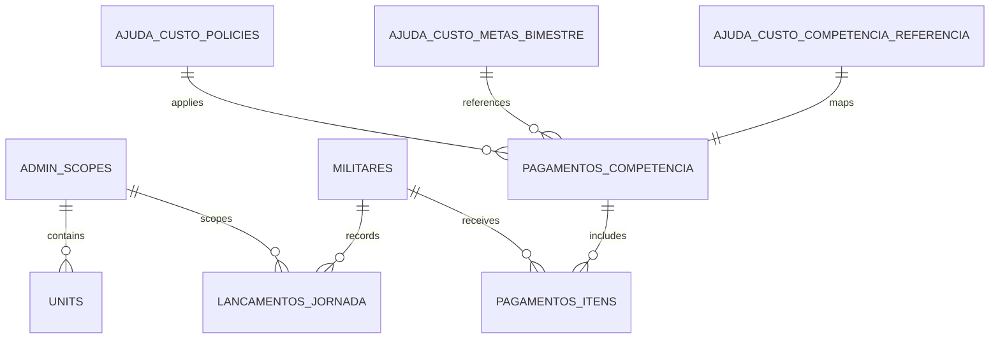

# Visão Geral

O **Guardião das Horas** é um sistema web interno para o **CBMMG** (Corpo de Bombeiros Militar de Minas Gerais) com foco em:

- **Controle da jornada e carga horária** (administrativa e operacional).
- **Escalas ordinárias** (publicação por ciclo e transparência ao militar).
- **Banco de horas** (créditos/débitos e compensações).
- **Cálculo e visualização de pagamentos indenizatórios** relacionados à jornada, com ênfase na **Ajuda de Custo para Despesas com Alimentação** (Decreto nº 49.006/2025 e Resoluções COFIN/CBMMG).
- **Relatórios mensais e trimestrais** por escopo/unidade, com **exportação do que estiver renderizado**.
- **Compatibilidade com dados legados** e prevenção de duplicidades (ex.: não gerar fechamento/relatório se já existir registro no legado para o mesmo período).

## Fontes normativas do projeto (Ajuda de Custo)

> **Objetivo desta seção:** deixar explícito, com base na “literatura” do projeto, **o que manda** no cálculo e **como o sistema deve se adaptar** às alterações normativas por vigência.

- **Decreto nº 49.006, de 12/03/2025 (texto atualizado)**  
  - Art. 2º: “paga mensalmente (…) na proporção dos dias efetivamente trabalhados” e vedação de cumulação com benefícios de mesma finalidade.  
  - Art. 2º, §4º: “É vedada a acumulação de mais de uma ajuda de custo por dia efetivamente trabalhado.”  
  - Art. 2º, §5º, II, “a”: no plantão que começa em um dia e termina em outro, paga “vinculada ao plantão do dia do seu início”.  
  - Art. 2º, §6º: veda “aproveitamento” das horas que ultrapassem o dia de início para nova ajuda de custo.  
  - Art. 1º, §4º e §5º (incluídos pelo Decreto nº 49.111/2025): permite **parcela fixa + parcela variável (metas)** e permite **limitação do valor máximo mensal** por resolução conjunta com o COFIN.
- **Resolução Conjunta COFIN/CBMMG nº 001, de 14/03/2025**  
  - Parcela única (fixa) de **R$ 50,00 por dia efetivamente trabalhado**.  
  - **Teto mensal total: R$ 1.100,00.**  
  - Autoriza **adequação dos valores diários** para jornadas operacionais específicas, visando percepção máxima do teto, mantida jornada mínima (6h/dia) e carga horária mínima (30h/semana).
- **Memorando Técnico Conjunto nº 02/2025 (DRH PMMG / DRH CBMMG)**  
  - Define **critérios para cômputo de horas/turnos** para fins da ajuda de custo.  
  - Tabela “Apêndice Único”: **valor de referência por turno de serviço** (ex.: até 24h → R$ 160,00).  
  - Define que o valor é baseado na **escala habitual registrada**, sem suplementação por extrapolação do turno e sem impacto de créditos/débitos do banco de horas.
- **Resolução Conjunta COFIN/CBMMG nº 002, de 15/10/2025 (vigente informada: “COFIN 002”)**  
  - Ajuda de custo por dia efetivamente trabalhado com **composição**:
    - **parcela fixa: R$ 50,00/dia**
    - **parcela variável: até R$ 25,00/dia**, vinculada a metas do **Plano de Metas e Indicadores** (Anexo I), proporcional ao cumprimento.
  - **Tetos mensais separados:** fixa R$ 1.100,00 + variável R$ 550,00 = **total R$ 1.650,00**.
  - Regra de metas:
    - considera metas do **bimestre anterior**
    - só paga variável se atingir **mínimo de 70%**
    - paga pela **média percentual do bimestre**
    - não há complementação posterior (“sem resíduo” para variável).

> **Conclusão prática (de engenharia):** o cálculo da Ajuda de Custo precisa ser **parametrizado por vigência** e suportar **dois modos de apuração**:
> 1) por “dia” (regime diário/administrativo), e  
> 2) por “turno/plantão” (regime operacional), com tabela do Memorando e as vedações do Decreto.

---

# Objetivos e Escopo

## Objetivos

1. Centralizar e padronizar o **controle de jornada** (administrativa e operacional) e seu reflexo em **créditos/débitos**.
2. Garantir **publicidade e acesso** do militar a **escala** e **banco de horas** (Lei nº 5.301/1969, §3º e §4º).
3. Fornecer uma **tela de visualização de pagamento** por mês, com **memória de cálculo** e rastreabilidade normativa (vigência, parâmetros e bases usadas).
4. Gerar **relatórios renderizados** (mensal/trimestral) por escopo, com **exportação** do que a UI exibe.
5. Operar com **compatibilidade/convivência com legado** e evitar inconsistências.

## Escopo (MVP)

- Cadastro e consulta de **Militares** (com modal e painel de dados).
- **Escalas** (especialmente operacional 24x72 e escalas administrativas).
- Registro de eventos que impactam jornada: **serviços/plantões, faltas, afastamentos, férias**, compensações.
- **Banco de horas**: extrato auditável + saldo por período.
- **Ajuda de Custo (Alimentação)**: tela de visualização e cálculo por competência, com:
  - decomposição **parcela fixa / variável** (COFIN 002),
  - aplicação da **tabela por turno** (Memorando 02/2025) quando aplicável,
  - aplicação de **tetos** por vigência.
- Relatórios mensais/trimestrais por escopo e exportação.

## Fora do escopo imediato (ou removido)

- **Importações** (módulo antigo): decisão de **remover** para não conflitar com arquitetura atual.
- **Exportações genéricas de banco**: decisão de manter **apenas export do que estiver renderizado** (relatórios/consultas) **[ABERTO: implementação detalhada]**.

---

# Requisitos Funcionais

## RF-01 Autenticação e Perfis
- Login e controle de acesso por perfil (admin, gestor, operador, consulta) **[INFERIDO]**.
- Restringir visualização por **escopo/unidade** (admin_scope).

## RF-02 Seleção de Escopo
- O usuário deve selecionar um **escopo** (admin_scope) para trabalhar.
- Toda consulta e gravação deve respeitar o escopo selecionado.

## RF-03 Militares
- Listar militares com busca/filtro.
- Abrir **modal do militar** ao clicar no nome.
- Exibir: dados básicos, lotação, regime/escala habitual, férias (fim original e fim com acréscimo), extrato de banco de horas.

## RF-04 Férias (exibição aprimorada)
- Na página inicial e no modal do militar:
  - Exibir **data fim original** (cadastrada).
  - Exibir **data fim com dias em acréscimo** (somatório).
- Evidenciar claramente a diferença.

## RF-05 Escalas
- Cadastrar/consultar escalas por unidade/escopo.
- Suportar jornada operacional **24x72** e demais regimes previstos em norma (ex.: COBOM, BOA, SSCIP) **[INFERIDO: amplitude do suporte]**.
- Publicar e versionar escalas (escala vigente).

## RF-06 Registro de Jornada / Eventos
- Registrar plantões, serviços, faltas, afastamentos, diligências e compensações.
- Garantir trilha de auditoria: quem registrou, quando, justificativa.

## RF-07 Banco de Horas
- Apurar créditos/débitos e gerar extrato por militar.
- Permitir ajustes controlados (com justificativa e log).
- Disponibilizar acesso ao militar (publicidade).

## RF-08 Ajuda de Custo (Alimentação) — Visualização e Memória de Cálculo

### RF-08.1 Tela principal (por competência)
- Selecionar mês (competência).
- Listar militares do escopo.
- Calcular valor por militar:
  - **parcela fixa**
  - **parcela variável** (quando aplicável)
  - total
  - tetos aplicados
- Mostrar claramente qual norma foi aplicada (COFIN 001 ou COFIN 002), com vigência.

### RF-08.2 Memória de cálculo (detalhada por militar)
A memória de cálculo deve mostrar:
- Base de apuração:
  - dias efetivamente trabalhados (regime diário) **e/ou**
  - turnos/plantões considerados (regime operacional)
- Regras do Decreto aplicadas:
  - **no máximo 1 por dia** (se houver 2 turnos no mesmo dia, escolher o “de maior valor” quando aplicável)
  - plantão que atravessa o dia: conta pelo **dia do início**
- Aplicação da tabela do Memorando (quando turno):
  - duração do turno → valor de referência → soma do mês
- Aplicação dos tetos por parcela (COFIN 002):
  - teto fixa (R$ 1.100)
  - teto variável (R$ 550)
  - total (R$ 1.650)
- Metas (quando variável existir):
  - qual **bimestre de referência** foi usado
  - percentual de execução
  - regra de corte (≥ 70% paga; < 70% não paga)
  - cálculo “proporcional” (ver RB-07.6)

### RF-08.3 Cadastro/parametrização (admin)
Para evitar “código hardcoded”, o sistema deve permitir:
- Cadastrar **parâmetros por vigência** (COFIN 001, COFIN 002 e futuras).
- Cadastrar **resultado das metas por bimestre** (percentual final do bimestre).
- Cadastrar **mapeamento competência → bimestre de referência** para parcela variável (necessário por causa da regra de transição da COFIN 002).

> Observação: você pediu “prefiro usar um filtro com campo onde ajusto a porcentagem”.  
> Isso vira requisito de UX: um campo (admin) para registrar/simular o percentual do bimestre, com separação entre **valor oficial** e **simulação** **[ABERTO: decisão de produto]**.

## RF-09 Relatórios e Exportação
- Gerar relatórios mensais e trimestrais (renderizados em tabela).
- Exportar **exatamente o que estiver renderizado** (PDF/CSV) **[ABERTO: formato e padrão]**.
- Prevenir duplicidade: não gerar relatórios se já existir fechamento no legado para o mesmo período/escopo **[INFERIDO a partir do histórico do projeto]**.

## RF-10 Compatibilidade com legado / correções pontuais
- Detectar e impedir inconsistências entre registros atuais e “banco legado”.
- Suportar correções pontuais de saldo (ex.: zerar saldos em `militar_day_balances` para casos específicos) **[ABERTO: procedimento padrão]**.

---

# Requisitos Não Funcionais

## RNF-01 Stack e Manutenibilidade (decisão)
- Backend: **Python + Flask + SQLAlchemy + Flask-Migrate**.
- Frontend: **Jinja + HTMX** (sem SPA React/Vue).
- UI deve ser implementável por IA com padrões e componentes reutilizáveis.

## RNF-02 Rastreabilidade normativa (Ajuda de Custo)
- Todo cálculo deve registrar:
  - **qual política/vigência** foi aplicada
  - parâmetros numéricos (valores diários, tetos, tabela de turnos)
  - bimestre e percentual de metas (quando houver variável)
- A memória de cálculo deve ser reprodutível (mesmo resultado para os mesmos dados).

## RNF-03 Auditoria e compliance
- Ajustes de parâmetro/meta devem registrar “quem/quando/por quê”.
- Exportação de relatórios deve permitir auditoria do que foi exibido.

## RNF-04 Performance
- Listagens paginadas.
- Parciais HTMX para reduzir reload completo.
- Índices por `admin_scope_id`, `militar_id`, `competencia`.

---

# Regras de Negócio e Cálculos

## RB-01 Carga Horária Semanal
- Regra geral: **40h semanais** (LC 127/2013, art. 1º).
- Aplicável a atividades administrativas, especializadas, ensino e operacionais (Resolução 1.265/2025, art. 4º).
- Se não atingir, deve ser complementada com **encargos móveis** (preferencialmente plantões operacionais) (Resolução 1.265/2025, art. 4º, §1º).

## RB-02 Jornada Operacional 24x72 (Prontidão de Incêndio)
- Turno de **24h** seguido de **72h** descanso/folga (Res. 1.265/2025, art. 11).
- A cada **21 plantões**, gera **crédito de 24h** (Res. 1.265/2025, art. 11, §1º).
- Carga horária excedente deve ser registrada (Res. 1.265/2025, art. 11, §3º).

## RB-03 Publicação de Escala
- Escala ordinária do mês publicada até **dia 20 do mês anterior** (Res. 1.265/2025, art. 22).
- Escalas ordinárias publicadas em ciclos de 7 dias e inseridas no sistema (Lei 5.301/1969, §3º).

## RB-04 Publicidade do Controle de Jornada e Banco de Horas
- Militares devem ter livre acesso à escala e banco de horas em sistema informatizado (Lei 5.301/1969, §4º).

---

## RB-07 Ajuda de Custo (Alimentação) — Regras consolidadas

### RB-07.1 Conceitos essenciais (para implementação)
- **Competência**: mês selecionado para visualização/cálculo.
- **Dia efetivamente trabalhado**:
  - regime diário: dia em que cumpriu a jornada mínima (6h), considerando também hipóteses do Art. 3º do Decreto (curso autorizado, serviço externo, viagem, etc.).
  - regime de plantão: o Decreto estabelece que, se o plantão atravessa o dia, o pagamento é **vinculado ao dia do início**.
- **Vedação “mais de uma por dia”**: não pode pagar duas ajudas no mesmo dia efetivamente trabalhado.
- **Regime operacional (plantão/turno)**: o Memorando 02/2025 estabelece “valor de referência por turno” e orienta o cômputo para essas jornadas.

### RB-07.2 Elegibilidade mínima
- Jornada mínima: **≥ 6h diárias e ≥ 30h semanais** (Decreto 49.006/2025, art. 1º, §1º; COFIN 001/002 repetem a regra).
- “Efetivo exercício” inclui teletrabalho (Decreto art. 1º, §2º; COFIN 001/002).

### RB-07.3 Parcelas e tetos por vigência

#### Vigência COFIN 001 (a partir de 13/03/2025)
- Parcela única (fixa): **R$ 50/dia efetivamente trabalhado**.
- Teto mensal: **R$ 1.100** (total).
- Autoriza adequação para jornada operacional específica (sem mudar teto).

#### Vigência COFIN 002 (a partir de 15/10/2025)
- Parcela fixa: **R$ 50/dia** (teto mensal **R$ 1.100**).
- Parcela variável: **até R$ 25/dia** (teto mensal **R$ 550**).
- Total máximo (somatório): **R$ 1.650**.
- Variável:
  - depende do **bimestre anterior**
  - paga se meta bimestral ≥ **70%**
  - paga proporcionalmente à média do bimestre
  - sem complementação posterior.

> **Regra de transição (COFIN 002):**
> - outubro/2025 e novembro/2025: paga **somente parcela fixa**.
> - 5º bimestre/2025 avaliado em novembro/2025 → variável paga em dezembro/2025 e janeiro/2026.
> - 6º bimestre/2025 avaliado em janeiro/2026 → variável paga em fevereiro/2026 e março/2026.

### RB-07.4 Tabela de referência por turno (Memorando 02/2025)
Apêndice Único – “Valor de referência da Ajuda de Custo por turno de serviço” (a partir de março/2025):

| Turno de serviço | Valor de referência |
|---|---:|
| Até 06h30 | 50,00 |
| 06h31 até 09h00 | 70,00 |
| 09h01 até 12h00 | 100,00 |
| 12h01 até 15h00 | 120,00 |
| 15h01 até 18h00 | 140,00 |
| 18h01 até 21h00 | 150,00 |
| 21h01 até 24h00 | 160,00 |

Outras regras operacionais do Memorando:
- o valor é determinado com base na **escala habitual registrada**;
- não há suplementação quando extrapola turno;
- créditos/débitos da escala são compensados no banco de horas, **sem impactar a ajuda de custo**.

### RB-07.5 Regras do Decreto que afetam plantões (muito relevante ao 24x72)
- **No máximo 1 ajuda de custo por dia efetivamente trabalhado**.
- Se o plantão começa em um dia e termina em outro, recebe a ajuda **do dia do início**.
- Não pode “aproveitar” as horas do dia seguinte para gerar nova ajuda.

### RB-07.6 Algoritmo de cálculo (como implementaremos)

#### RB-07.6.1 Resolver a política por competência (Policy Resolver)
1) Determinar qual Resolução COFIN aplica-se à competência (COFIN 001 x COFIN 002), por data de vigência.
2) Ativar/Desativar parcela variável conforme regra de transição e mapeamento competência→bimestre.

> **Implementação:** `AjudaCustoPolicyResolver.resolve(competencia) -> policy`

#### RB-07.6.2 Montar a base “efetivamente trabalhada”
Para cada militar na competência:
1) Coletar eventos/lancamentos de jornada e/ou turnos programados (escala habitual), conforme disponibilidade do sistema.
2) Filtrar:
   - **conta** como efetivamente trabalhado (inclui hipóteses do Art. 3º do Decreto) **[ABERTO: lista completa em tabela no sistema]**
   - **não é devida** (ex.: falta, férias, sobreaviso, feriados/ponto facultativo sem escala, etc., conforme Memorando item 2.3)
3) Agrupar por “unidade de pagamento”:
   - regime diário: por dia
   - regime de plantão: por turno, mas “chaveado” no **dia do início**
4) Se houver mais de um turno no mesmo dia (situação rara, mas possível em acumulação lícita / ajustes):
   - escolher o **de maior valor** (Decreto art. 2º, §5º, II, “b”) e obedecer §4º.

#### RB-07.6.3 Cálculo da parcela fixa
- **Regime diário:** `dias_validos × 50`, limitado a `teto_fixo`.
- **Regime plantão/operacional:** somar “valor de referência por turno” da tabela do Memorando e limitar ao teto aplicável.

> Nota: isso atende a “adequação dos valores diários” prevista nas Resoluções COFIN e explica o cenário real do operacional 24x72:  
> 7 plantões × 160 = 1120 → teto fixa 1100 (bate teto “em normalidade”).

#### RB-07.6.4 Cálculo da parcela variável (COFIN 002)
**Regra normativa (certa):**
- se meta_bimestre < 70% → variável = 0
- se meta_bimestre ≥ 70% → proporcional à média do bimestre, limitada ao teto variável.

**Base de cálculo (ponto técnico com interpretação):**
- **[INFERIDO + justificativa]**: usar “dias equivalentes” derivados da base fixa, para manter coerência com a adequação do operacional:
  - `dias_equivalentes = parcela_fixa_bruta / 50`
  - `variavel_bruta = dias_equivalentes × 25 × (meta_percentual/100)`
  - `variavel = min(variavel_bruta, teto_variavel)`
- **[ABERTO – alternativa]**: calcular variável estritamente por “dias calendário” distintos com jornada válida (1 por dia), o que tende a reduzir a variável do operacional; esta alternativa deve ser validada contra orientações internas/folha.

> **Decisão proposta:** implementar as duas estratégias e escolher por parâmetro `variable_base_mode` (DEFAULT: `EQUIVALENT_DAYS`) até validação final.

#### RB-07.6.5 Regras de abatimento/compensação
- DSP/diárias: o Memorando define débito do valor da parcela alimentação prevista na diária (glosa/compensação em folha).
- Jornada reduzida: para cada escala não cumprida, abate uma ajuda, limitado a 3 por semana.

> **[ABERTO]**: Como representar “compensação em folha subsequente” no sistema:
> - opção A: calcular “valor devido” por competência e registrar “glosa a aplicar” em competência subsequente;
> - opção B: calcular diretamente o “valor que será pago na folha X” (competência de apuração vs mês de pagamento).

### RB-07.7 Exemplo (para validar com a realidade)
Militar operacional 24x72, mês com 7 plantões de 24h, sem faltas:
- Base por turno (Memorando): 7 × 160 = 1120
- Parcela fixa: teto 1100 → **1100**
- Parcela variável (meta 100%, base por dias equivalentes):
  - dias_equivalentes = 1100/50 = 22
  - variável bruta = 22 × 25 = 550
  - teto variável = 550 → **550**
- Total (COFIN 002): 1100 + 550 = **1650 (teto total)**

---

# Modelagem de Dados

> **Nota:** a modelagem abaixo consolida o que foi discutido e cria tabelas coerentes onde necessário. Tabelas/campos não explicitamente confirmados estão marcados como **[INFERIDO]** e/ou **[ABERTO]**.

## Entidades e campos (tabelas)

### Núcleo (já previsto no projeto)
- `admin_scopes` **[INFERIDO]**
- `units` **[INFERIDO]**
- `militares`
- `militar_lotacoes` **[INFERIDO]**
- `militar_regimes` **[INFERIDO]**
- `ferias`, `ferias_acrescimos` **[INFERIDO]**
- `escala_publicacoes`, `escala_itens` **[INFERIDO]**
- `lancamentos_jornada` **[INFERIDO]**
- `militar_day_balances` **[EXISTENTE no projeto; schema real: ABERTO]**
- `users`, `roles`, `audit_log` **[INFERIDO]**

## Ajuda de Custo (novas tabelas para refletir COFIN 001/002 e futuras)

### 1) `ajuda_custo_policies` (parâmetros por vigência) **[INFERIDO]**
Armazena “o que vale” em cada período.

Campos recomendados:
- `id` (PK)
- `nome` (ex.: “COFIN/CBMMG 001/2025”, “COFIN/CBMMG 002/2025”)
- `vigencia_inicio` (date)
- `vigencia_fim` (date, nullable)
- `fixo_valor_dia` (decimal) — ex.: 50
- `variavel_valor_dia_max` (decimal) — ex.: 0 (COFIN 001) ou 25 (COFIN 002)
- `teto_fixo_mensal` (decimal) — ex.: 1100
- `teto_variavel_mensal` (decimal) — ex.: 0 (COFIN 001) ou 550 (COFIN 002)
- `total_teto_mensal` (decimal) — ex.: 1100 ou 1650 (pode ser derivado)
- `meta_min_percent` (decimal) — ex.: 70 (quando houver variável)
- `variable_base_mode` (enum) — `EQUIVALENT_DAYS` | `CALENDAR_DAYS` (**ver RB-07.6.4**)
- `source_ref` (texto) — referência da norma (arquivo, data)

### 2) `ajuda_custo_turno_valores` (tabela do Memorando por vigência) **[INFERIDO]**
Campos:
- `id` (PK)
- `vigencia_inicio`, `vigencia_fim`
- `min_minutes` (int)
- `max_minutes` (int)
- `valor` (decimal)

> Observação: para 24h, `min_minutes=1261` `max_minutes=1440` `valor=160`.

### 3) `ajuda_custo_metas_bimestre` (resultado do bimestre) **[INFERIDO]**
Campos:
- `id` (PK)
- `ano` (int)
- `bimestre_num` (int) — 1..6
- `period_start` (date)
- `period_end` (date)
- `percent_execucao` (decimal) — nota/percentual final
- `status` (enum) — `PROVISORIO` | `DEFINITIVO` | `RECORRIDO`
- `avaliado_em` (date)
- `observacao` (text)
- `source_ref` (text)

### 4) `ajuda_custo_competencia_referencia` (mês → bimestre usado) **[INFERIDO]**
Motivo: a COFIN 002 traz regra de transição (dez/2025 e jan/2026 usam 5º bimestre etc.).  
Campos:
- `id` (PK)
- `competencia` (YYYY-MM)
- `bimestre_ano` (int)
- `bimestre_num` (int)
- `motivo` (text) — “regra de transição COFIN 002”, “regra geral”, etc.

## Pagamentos (ajuste para decomposição fixa/variável)

### `pagamentos_competencia` (ajuste)
Adicionar:
- `policy_id` (FK ajuda_custo_policies)
- `bimestre_ref_id` (FK ajuda_custo_metas_bimestre, nullable)
- `meta_percent_usado` (decimal, nullable) — snapshot
- `is_simulacao` (bool) / `meta_percent_simulado` (decimal) **[ABERTO]**

### `pagamentos_itens` (ajuste)
Adicionar:
- `valor_fixo_bruto`, `valor_fixo_teto_aplicado`
- `valor_variavel_bruto`, `valor_variavel_teto_aplicado`
- `valor_total`
- `glosas_total` (ex.: DSP/diárias) **[ABERTO]**
- `memoria_calculo` (json/text) — deve carregar: turnos, dias, parâmetros, tetos, meta, estratégia.

---

## Relacionamentos (principais)
- `ajuda_custo_policies` 1—N `pagamentos_competencia`
- `ajuda_custo_metas_bimestre` 1—N `pagamentos_competencia` (via bimestre de referência)
- `ajuda_custo_turno_valores` usado por `AjudaCustoCalculator` (não precisa FK direta em pagamentos; salvar snapshot em memória de cálculo)

---

## Trechos SQL (DDL ilustrativo)

```sql
-- Ajuda de Custo: parâmetros por vigência (exemplo)
CREATE TABLE ajuda_custo_policies (
  id INTEGER PRIMARY KEY,
  nome TEXT NOT NULL,
  vigencia_inicio DATE NOT NULL,
  vigencia_fim DATE,
  fixo_valor_dia NUMERIC NOT NULL,
  variavel_valor_dia_max NUMERIC NOT NULL DEFAULT 0,
  teto_fixo_mensal NUMERIC NOT NULL,
  teto_variavel_mensal NUMERIC NOT NULL DEFAULT 0,
  meta_min_percent NUMERIC,
  variable_base_mode TEXT NOT NULL DEFAULT 'EQUIVALENT_DAYS',
  source_ref TEXT,
  created_at DATETIME DEFAULT CURRENT_TIMESTAMP
);

CREATE TABLE ajuda_custo_turno_valores (
  id INTEGER PRIMARY KEY,
  vigencia_inicio DATE NOT NULL,
  vigencia_fim DATE,
  min_minutes INTEGER NOT NULL,
  max_minutes INTEGER NOT NULL,
  valor NUMERIC NOT NULL,
  source_ref TEXT
);

CREATE TABLE ajuda_custo_metas_bimestre (
  id INTEGER PRIMARY KEY,
  ano INTEGER NOT NULL,
  bimestre_num INTEGER NOT NULL,
  period_start DATE NOT NULL,
  period_end DATE NOT NULL,
  percent_execucao NUMERIC NOT NULL,
  status TEXT NOT NULL DEFAULT 'DEFINITIVO',
  avaliado_em DATE,
  source_ref TEXT,
  observacao TEXT
);

CREATE TABLE ajuda_custo_competencia_referencia (
  id INTEGER PRIMARY KEY,
  competencia TEXT NOT NULL UNIQUE, -- 'YYYY-MM'
  bimestre_ano INTEGER NOT NULL,
  bimestre_num INTEGER NOT NULL,
  motivo TEXT
);
```

---

# Arquitetura

## Backend (rotas/serviços/camadas/etc)

### Princípios
- Rotas finas (controllers) + serviços para regras de negócio.
- Acesso a dados via SQLAlchemy (repositórios/opcionais).
- Detecção de requisições HTMX via header `HX-Request`.

### Camadas sugeridas **[INFERIDO]**
- `routes/` (Blueprints Flask)
- `services/` (regras e cálculos)
- `models/` (SQLAlchemy)
- `repositories/` (queries complexas)
- `templates/` (Jinja)
- `static/` (CSS/JS mínimo)

### Serviço de Ajuda de Custo (proposta)
Criar um módulo coeso:

```text
services/ajuda_custo/
  policy_resolver.py       # escolhe COFIN 001/002 por vigência e decide se variável ativa
  turno_table.py           # consulta tabela do memorando por vigência
  metas_repo.py            # busca percentual do bimestre (e status)
  competencia_ref.py       # mapeia competência -> bimestre (com override)
  calculator.py            # AjudaCustoCalculator (fixo/variavel/glosas/memória)
  memory_builder.py        # gera memória de cálculo estruturada
```

**Responsabilidade chave:** separar “literatura” (norma) da implementação:
- as tabelas `ajuda_custo_*` são a materialização dos parâmetros normativos,
- o `calculator` apenas aplica regras e registra memória.

## Frontend (telas/fluxos/componentes/etc)

## Decisão de stack (confirmada)
- **Flask + Jinja + HTMX**
- Criar:
  - **macros Jinja (componentes)**
  - **partials HTMX** padronizados (fragmentos `_table.html`, `_modal.html`, etc.)

### Estrutura recomendada de templates
```text
templates/
  base.html
  layouts/
    app.html
    auth.html
  components/
    ui.html
    form.html
    table.html
    modal.html
    badges.html
  pages/
    pagamentos/
      index.html
      _table.html
      _calc_modal.html
    admin/
      ajuda_custo/
        policies.html
        metas.html
        referencias.html
```

### Contrato HTMX (padrões obrigatórios)
- Listagens sempre atualizam `#results`
- Modais sempre carregam em `#modal`
- Endpoints retornam:
  - Página completa quando não-HTMX
  - Partial quando HTMX

---

# Fluxos

## Fluxo principal do sistema (flowchart)

```mermaid
flowchart TD
  A[Login] --> B[Selecionar Escopo/Unidade]
  B --> C[Militares: listar e consultar]
  C --> D[Escalas: consultar/publicar]
  D --> E[Lançamentos: plantões/faltas/afastamentos/férias/compensações]
  E --> F[Banco de Horas: crédito/débito]
  F --> G[Ajuda de Custo: selecionar mês]
  G --> G1[Resolver Política por Vigência (COFIN 001/002)]
  G1 --> G2[Montar Base: dias/turnos elegíveis]
  G2 --> G3[Aplicar Tetos e Metas (bimestre)]
  G3 --> G4[Gerar Memória de Cálculo]
  G4 --> H[Relatórios: mensal/trimestral + export renderizado]
  H --> I[Fechamento e auditoria]
```

## Modelo ER (erDiagram)



---

# Telas e UX

## Lista de telas (MVP)

1. **Login**
2. **Dashboard (Home)**
3. **Militares (Listagem)**
4. **Militar (Modal/Detalhes)**
5. **Escalas**
6. **Lançamentos de Jornada**
7. **Banco de Horas (Extrato)**
8. **Pagamentos (Ajuda de Custo) – Visualização por mês**
9. **Admin – Ajuda de Custo (Parâmetros, Metas e Referências)**
10. **Relatórios (Mensal/Trimestral)**

## Pagamentos (Ajuda de Custo) — campos e UX

### Tela principal
- Seletor de competência (YYYY-MM).
- “Badge” de política aplicada:
  - “COFIN 001/2025” ou “COFIN 002/2025”
  - vigência
- Campos informativos:
  - teto fixa (1100) e teto variável (550) quando COFIN 002
  - bimestre de referência e percentual de metas (se variável)
- Filtros:
  - unidade, situação, regime
  - **percentual de metas (simulação)** (se habilitado) **[ABERTO]**
- Tabela por militar:
  - base (dias/turnos)
  - fixa (bruto, teto)
  - variável (bruto, teto)
  - total
  - “ver memória”

### Modal “Memória de Cálculo”
- Lista de turnos/dias considerados com data-chave:
  - em plantão, usar “dia do início”
- Indicar regras do Decreto aplicadas (1 por dia; maior valor no mesmo dia; vedação de reaproveitamento)
- Tabela de turnos (duração → valor de referência) quando aplicável
- Metas (bimestre) com regra 70% (paga / não paga)
- Totais e tetos

## Admin – Ajuda de Custo
- **Parâmetros por vigência** (CRUD): valores diários, tetos, meta mínima, modo base da variável.
- **Tabela de turnos** (CRUD por vigência): min/max minutos e valor.
- **Metas por bimestre** (CRUD): percentual e status (provisório/definitivo/recorrido).
- **Competência → bimestre** (CRUD): mapeamento e motivo (transição).

---

# APIs e Contratos

> Contratos orientativos (podem ser HTMX-first; JSON opcional no futuro).

## Pagamentos (Ajuda de Custo)
- `GET /pagamentos/ajuda-custo`
  - Query: `competencia=YYYY-MM`
  - Resposta: página completa
- `GET /pagamentos/ajuda-custo/table?competencia=YYYY-MM&meta_simulada=...`
  - Resposta HTMX: `_table.html`
- `GET /pagamentos/ajuda-custo/<competencia>/<militar_id>/memoria`
  - Resposta HTMX: `_calc_modal.html`

## Admin (Ajuda de Custo)
- `GET /admin/ajuda-custo/policies`
- `POST /admin/ajuda-custo/policies`
- `GET /admin/ajuda-custo/turnos`
- `POST /admin/ajuda-custo/turnos`
- `GET /admin/ajuda-custo/metas`
- `POST /admin/ajuda-custo/metas`
- `GET /admin/ajuda-custo/referencias`
- `POST /admin/ajuda-custo/referencias`

---

# Estratégia de Testes

## Testes de unidade (services/ajuda_custo)
- Resolver política por competência:
  - antes/depois de 15/10/2025 (COFIN 001 vs 002)
  - out/nov 2025: variável desabilitada (transição)
- Tabela por turno:
  - 24h → 160
  - limites de faixa (06h30 vs 06h31 etc)
- Plantão atravessando dia:
  - contar pelo dia do início (sem duplicar)
  - dois turnos no mesmo dia → escolher maior valor
- Teto:
  - fixo: cap em 1100
  - variável: cap em 550
  - total: coerente com somatório
- Metas:
  - 69% → variável zero
  - 70% e 100% → proporcionalidade

## Casos de aceitação (importantes)
- **Operacional 24x72 “normal”:** 7 plantões de 24h → fixa bate teto 1100; com meta 100% → total 1650.
- **Administrativo:** 22 dias trabalhados no mês → fixa 1100; variável depende meta e teto 550.
- **Férias/falta/sobreaviso:** não deve contar (conforme Memorando item 2.3) **[ABERTO: codificar lista completa]**.
- **DSP/Diárias:** gerar glosa/compensação a partir da parcela alimentação **[ABERTO: fonte do valor]**.

---

# Decisões Registradas (ADR resumidos)

## ADR-001 — Stack de Interface (Jinja + HTMX)
- **Contexto:** necessidade de UI consistente, com desenvolvimento assistido por IA e baixo custo de manutenção.
- **Decisão:** usar **Flask + Jinja + HTMX**, evitando SPA React/Vue.
- **Motivo:** menor complexidade (sem build/estado), melhor alinhamento com backend, mais previsível para IA.
- **Impacto:** padronização forte de templates/macros/partials; interações ricas via HTMX.

## ADR-004 — Exportação apenas do renderizado (relatórios/consultas)
- **Contexto:** desejo de não manter export genérico de tabelas/BD.
- **Decisão:** implementar export somente a partir de tabelas renderizadas.
- **Motivo:** reduz acoplamento e evita inconsistências.
- **Impacto:** export precisa “congelar” a visão (hash/render) **[INFERIDO]**.

## ADR-007 — Ajuda de Custo parametrizada por vigência (COFIN 001/002)
- **Contexto:** normas mudam; teto e composição mudaram (fixa/variável/metas).
- **Decisão:** materializar normas em tabelas `ajuda_custo_*` por vigência e resolver política por competência.
- **Motivo:** evita hardcode e facilita atualização.
- **Impacto:** exige telas admin e memória de cálculo com “snapshot” dos parâmetros.

## ADR-008 — Operacional usa tabela por turno (Memorando 02/2025) e respeita vedações do Decreto
- **Contexto:** operacional 24x72 recebe teto em normalidade; cálculo por “dias calendário” não reflete.
- **Decisão:** para regime de plantão, apurar por turno (tabela do Memorando), limitando por teto e aplicando:
  - 1 por dia,
  - plantão pelo dia do início,
  - escolher maior valor se dois turnos no mesmo dia.
- **Motivo:** aderência ao Decreto e ao Memorando.
- **Impacto:** exige dados de início/fim do turno e uma camada de agregação por dia do início.

## ADR-009 — Parcela variável: base por “dias equivalentes” (provisório) **[ABERTO]**
- **Contexto:** COFIN 002 autoriza adequação e introduz variável por dia; não há tabela explícita para variável em plantões.
- **Decisão:** implementar `variable_base_mode` com default `EQUIVALENT_DAYS` e manter alternativa `CALENDAR_DAYS`.
- **Motivo:** permitir validação contra folha/entendimento oficial sem reescrever código.
- **Impacto:** decisão final deve ser registrada após validação.

---

# Pendências e Próximos Passos

1. **Implementar tabelas `ajuda_custo_*`** e seed inicial com COFIN 001/002 e a tabela do Memorando.
2. Implementar serviço `AjudaCustoPolicyResolver` + `AjudaCustoCalculator` + geração de memória.
3. Criar telas admin para:
   - parâmetros por vigência
   - metas por bimestre
   - competência → bimestre (transição)
4. Validar com casos reais (incluindo operacional 24x72 que bate teto):
   - comparar com folha em pelo menos 3 competências.
5. Fechar decisões **[ABERTO]**:
   - base da variável (dias equivalentes vs dias calendário)
   - regra competência (mês de referência) vs mês de pagamento e glosas em folha subsequente
   - definição de “dias úteis” para regime diário e como tratar feriados/ponto facultativo.

---

# Riscos e Pontos de Atenção

1. **Mudanças normativas recorrentes:** necessidade de políticas por vigência e atualização sem mexer no código.
2. **Base da variável no operacional:** se implementada errada, divergirá da folha (risco alto).
3. **Dados de turnos incompletos:** sem início/fim do turno ou escala habitual, o cálculo fica inconsistente.
4. **Glosas/compensações em folha subsequente:** risco de “competência vs pagamento” confundir usuário; UX precisa ser clara.
5. **Permissões e auditoria:** parâmetros e metas são dados sensíveis (impactam pagamento), exigem controle e log.

---

# Falta discutir/planejar

1. Tabela completa e codificação formal das situações:
   - “mantém o direito” (Art. 3º do Decreto, itens do Memorando)
   - “não é devida” (Memorando 2.3)
   - “gera glosa/compensação” (DSP/diárias etc.)
2. Integração (ou não) com SEI/relatórios formais de avaliação de metas (COFIN 002).
3. Definição de política de feriados/ponto facultativo e “dia útil” no cálculo diário.
4. Procedimento padrão para correções pontuais (saldo e pagamentos) e como auditar isso no sistema.