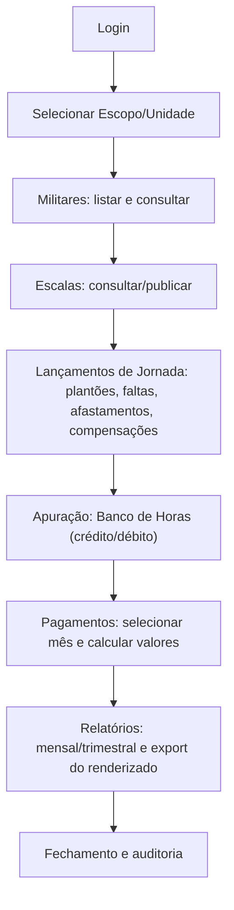
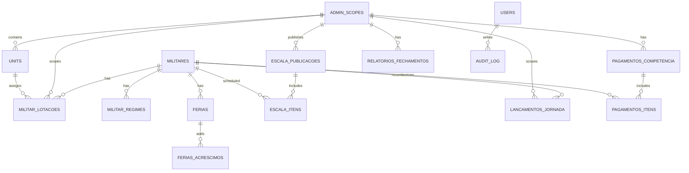

# Visão Geral

O **Guardião das Horas** é um sistema web interno para o **CBMMG** (Corpo de Bombeiros Militar de Minas Gerais) com foco em:

- **Controle da jornada e carga horária** (administrativa e operacional).
- **Escalas ordinárias** (publicação por ciclo e transparência ao militar).
- **Banco de horas** (créditos/débitos e compensações).
- **Cálculo e visualização de pagamentos indenizatórios** relacionados à jornada (ex.: ajuda de custo para alimentação, conforme normas vigentes).
- **Relatórios mensais e trimestrais** por escopo/unidade, com **exportação do que estiver renderizado**.
- **Compatibilidade com dados legados** e prevenção de duplicidades (ex.: não gerar fechamento/relatório se já existir registro no legado para o mesmo período).

> Base normativa mínima (trechos literais):
>
> - **Lei 5.301/1969 (EMEMG), §3º e §4º (acrescidos por LC 168/2022)**  
>   “**As escalas ordinárias** de trabalho dos militares serão publicadas em **ciclos de sete dias**, com no mínimo sete dias de antecedência, e **inseridas no sistema de dados** da instituição para acompanhamento e controle.”  
>   “Os militares terão **livre acesso** à respectiva escala de trabalho e ao respectivo **banco de horas**, por meio de acesso a **sistema informatizado específico** (…)”
>
> - **Lei Complementar 127/2013, art. 1º**  
>   “A carga horária semanal de trabalho (…) será de **quarenta horas semanais**, ressalvado o disposto no art. 15 da Lei Estadual nº 5.301/1969.”
>
> - **Resolução CBMMG nº 1.265/2025, art. 11**  
>   “A jornada operacional terá a duração de **24 horas** (…) seguida de **72 horas de descanso e folga**.”  
>   “A cada **21 plantões** de 24 horas (…) **compensação de 24 horas de crédito**.”
>
> - **Decreto nº 49.006/2025, art. 2º**  
>   “A ajuda de custo (…) será paga mensalmente (…) **na proporção dos dias efetivamente trabalhados**, sendo **vedada** (…) de forma cumulativa com outros benefícios (…) de mesma finalidade.”
>
> - **Memorando Técnico Conjunto 02/2025 (DRH-PMMG/DRH-CBMMG)**  
>   “O cálculo (…) considerará os **dias efetivamente trabalhados**, levando-se em consideração as **peculiaridades das escalas**.”  
>   “O valor (…) será determinado com base na **escala habitual registrada** nos sistemas informatizados (…)”  
>   “Créditos e débitos de horas (…) serão compensados e ajustados no cômputo da jornada mensal e **não impactarão** o valor da ajuda de custo (…)”

---

# Objetivos e Escopo

## Objetivos

1. Centralizar e padronizar o **controle de jornada** (administrativa e operacional) e seu reflexo em **créditos/débitos**.
2. Garantir **publicidade e acesso** do militar a **escala** e **banco de horas** (conforme Lei 5.301/1969, §3º e §4º).
3. Fornecer uma **tela de visualização de pagamento** por mês, com **memória de cálculo** (explicação do valor).
4. Gerar **relatórios renderizados** (mensal/trimestral) por escopo, com **exportação** do que a UI exibe.
5. Operar com **compatibilidade/convivência com legado** e evitar inconsistências.

## Escopo (MVP)

- Cadastro e consulta de **Militares** (com modal e painel de dados).
- **Escalas** (especialmente operacional 24x72 e escalas administrativas).
- Registro de eventos que impactam jornada: **serviços/plantões, faltas, afastamentos, férias**, compensações.
- **Banco de horas**: extrato auditável + saldo por período.
- **Pagamentos**: tela de visualização e cálculo por mês (com teto/limites conforme regras vigentes) **[ABERTO]**.
- Relatórios mensais/trimestrais por escopo e exportação.

## Fora do escopo imediato (ou removido)

- **Importações** (módulo antigo): decisão de **remover** para não conflitar com arquitetura atual.  
- **Exportações genéricas de banco**: decisão de manter **apenas export do que estiver renderizado** (relatórios/consultas) **[ABERTO: implementação detalhada]**.

---

# Requisitos Funcionais

## RF-01 Autenticação e Perfis
- Login e controle de acesso por perfil (admin, gestor, operador, consulta) **[INFERIDO]**.
- Restringir visualização por **escopo/unidade** (admin_scope).

## RF-02 Seleção de Escopo
- O usuário deve selecionar um **escopo** (admin_scope) para trabalhar.
- Toda consulta e gravação deve respeitar o escopo selecionado.

## RF-03 Militares
- Listar militares com busca/filtro.
- Abrir **modal do militar** ao clicar no nome.
- Exibir: dados básicos, lotação, regime/escala habitual, férias (fim original e fim com acréscimo), extrato de banco de horas.

## RF-04 Férias (exibição aprimorada)
- Na página inicial e no modal do militar:
  - Exibir **data fim original** (cadastrada).
  - Exibir **data fim com dias em acréscimo** (somatório).
- Evidenciar claramente a diferença.

## RF-05 Escalas
- Cadastrar/consultar escalas por unidade/escopo.
- Suportar jornada operacional **24x72** e demais regimes previstos em norma (ex.: COBOM, BOA, SSCIP) **[INFERIDO: amplitude do suporte]**.
- Publicar e versionar escalas (escala vigente).

## RF-06 Registro de Jornada / Eventos
- Registrar plantões, serviços, faltas, afastamentos, diligências e compensações.
- Garantir trilha de auditoria: quem registrou, quando, justificativa.

## RF-07 Banco de Horas
- Apurar créditos/débitos e gerar extrato por militar.
- Permitir ajustes controlados (com justificativa e log).
- Disponibilizar acesso ao militar (publicidade).

## RF-08 Pagamentos (tela de visualização)
- Selecionar mês.
- Listar militares do escopo.
- Calcular valor a pagar por militar (ex.: ajuda de custo alimentação) com memória de cálculo.
- Permitir filtros (incluindo um **campo percentual** para simulação/ajuste) — decisão do projeto.

> Observação crítica: houve divergência prática relatada: militar em **24x72 sem faltas** estaria recebendo **teto máximo**, e uma simulação anterior não refletiu isso. Regras exatas de teto e parâmetros devem ser consolidadas com a norma atual **[ABERTO]**.

## RF-09 Relatórios e Exportação
- Gerar relatórios mensais e trimestrais (renderizados em tabela).
- Exportar **exatamente o que estiver renderizado** (PDF/CSV) **[ABERTO: formato e padrão]**.
- Prevenir duplicidade: não gerar relatórios se já existir fechamento no legado para o mesmo período/escopo **[INFERIDO a partir do histórico do projeto]**.

## RF-10 Compatibilidade com legado / correções pontuais
- Detectar e impedir inconsistências entre registros atuais e “banco legado”.
- Suportar correções pontuais de saldo (ex.: zerar saldos em `militar_day_balances` para casos específicos) **[ABERTO: procedimento padrão]**.

---

# Requisitos Não Funcionais

## RNF-01 Stack e Manutenibilidade (decisão)
- Backend: **Python + Flask + SQLAlchemy + Flask-Migrate**.
- Frontend: **Jinja + HTMX** (sem SPA React/Vue).
- UI deve ser implementável por IA com padrões e componentes reutilizáveis.

## RNF-02 Segurança
- Autenticação obrigatória.
- Autorização por perfil + escopo.
- Auditoria de operações sensíveis (ajustes de saldo, edições de eventos, fechamentos).

## RNF-03 Observabilidade
- Logs estruturados de ações e erros.
- Registro de auditoria persistente (tabela `audit_log`) **[INFERIDO]**.

## RNF-04 Performance
- Listagens paginadas.
- Parciais HTMX para reduzir reload completo.
- Consultas com índices por `admin_scope_id`, `militar_id`, `competencia`.

## RNF-05 Evolução e Extensibilidade
- Separar regras de negócio em serviços.
- Padronizar contratos HTMX e macros.
- Permitir no futuro endpoints JSON para módulos específicos **[INFERIDO]**.

## RNF-06 Processo de Desenvolvimento (Git)
- Uso de branches feature para evitar deploy em `main`.
- Commits com mensagens em inglês (padrão do projeto).
- PRs para integrar em ambiente seguro.

---

# Regras de Negócio e Cálculos

## RB-01 Carga Horária Semanal
- Regra geral: **40h semanais** (LC 127/2013, art. 1º).
- Aplicável a atividades administrativas, especializadas, ensino e operacionais (Resolução 1.265/2025, art. 4º).
- Se não atingir, deve ser complementada com **encargos móveis** (preferencialmente plantões operacionais) (Resolução 1.265/2025, art. 4º, §1º).

## RB-02 Jornada Operacional 24x72 (Prontidão de Incêndio)
- Turno de **24h** seguido de **72h** descanso/folga (Res. 1.265/2025, art. 11).
- A cada **21 plantões**, gera **crédito de 24h** (Res. 1.265/2025, art. 11, §1º).
- Carga horária excedente deve ser registrada (Res. 1.265/2025, art. 11, §3º).

## RB-03 Publicação de Escala
- Escala ordinária do mês publicada até **dia 20 do mês anterior** (Res. 1.265/2025, art. 22).
- Escalas ordinárias publicadas em ciclos de 7 dias e inseridas no sistema (Lei 5.301/1969, §3º).

## RB-04 Controle e Publicidade do Controle de Jornada
- Controle executado por chefias; até haver sistema, usa planilha padrão; objetivo de sistema acessível aos militares (Res. 1.265/2025, art. 20, §1º).
- Militares devem ter livre acesso à escala e banco de horas em sistema informatizado (Lei 5.301/1969, §4º).

## RB-05 Horário Alternativo para Estudos (ITRH 247/2013)
- Possível adequar horários para militares que estudam (Art. 2º).
- Horário alternativo exige **reposição/compensação** da jornada (Art. 3º e 10º).
- Medidas de compensação: reduzir almoço, atividades quarta à tarde, chamadas em folga, encargos móveis (Art. 11).

## RB-06 Jornada Reduzida (20h semanais) — Militar responsável por pessoa com deficiência (ITRH 301/2025)
- Benefício temporário, validade **6 meses**, renovável (Art. 2º).
- Não pode ser designado para serviço operacional, com exceções específicas (Art. 6º).
- Processo e documentação via SEI, com sigilo por dados sensíveis (Art. 7º, 8º, 10º).
- Unidade deve manter controle e comunicar cessação/renovação (Art. 17).

## RB-07 Ajuda de custo para despesas com alimentação (Decreto 49.006/2025 + Memorando 02/2025)
### Condições gerais
- Natureza indenizatória; paga mensalmente em pecúnia (Art. 2º).
- Proporcional aos **dias efetivamente trabalhados** (Art. 2º).
- Vedada cumulatividade com benefícios de mesma finalidade (Art. 2º).
- Regra mínima: carga horária ≥ **6h diárias** e **30h semanais** (Art. 1º, §1º).
- Descontos por férias/afastamentos/faltas conforme decreto (Art. 2º, §2º e §3º).

### Diretrizes operacionais (Memorando 02/2025)
- Considerar peculiaridades das escalas ao calcular dias efetivamente trabalhados.
- Valor determinado pela **escala habitual registrada** nos sistemas.
- Extrapolação do turno não suplementa valor.
- Créditos/débitos de horas não impactam o valor da ajuda de custo.
- Existe teto mensal definido por resoluções conjuntas COFIN/PMMG e COFIN/CBMMG **[ABERTO: parametrização atual e atualização mencionada]**.

## RB-08 Teto / Limites e Atualizações Normativas
- Foi relatada **atualização de resolução** que muda teto e outros pontos.
- A regra exata do teto para o cálculo do pagamento mensal (especialmente operacional 24x72) está **[ABERTO]** e precisa ser consolidada com a versão vigente dos parâmetros (resoluções conjuntas COFIN/PMMG e COFIN/CBMMG citadas no memorando).

## RB-09 Férias com Acréscimos
- UI deve calcular “fim com acréscimo” = fim original + dias de acréscimo (regras internas do sistema).
- Deve preservar fim original para auditoria e transparência.

---

# Modelagem de Dados

> **Nota:** a modelagem abaixo consolida o que foi discutido e cria tabelas coerentes onde necessário. Tabelas/campos não explicitamente confirmados estão marcados como **[INFERIDO]** e/ou **[ABERTO]**.

## Entidades e campos (tabelas)

### 1) `admin_scopes` **[INFERIDO]**
- `id` (PK)
- `name`
- `code` (ex.: “7BBM”, “6CIAIND”)
- `is_active`

### 2) `units` (unidades/subunidades) **[INFERIDO]**
- `id` (PK)
- `admin_scope_id` (FK)
- `name`
- `parent_unit_id` (FK self, nullable)

### 3) `militares`
Campos mínimos (MVP):
- `id` (PK)
- `matricula` (único)
- `nome_completo`
- `nome_guerra`
- `posto_graduacao` (texto/enum) **[ABERTO: tabela de referência]**
- `situacao` (ativo/inativo/agregado/…)
- `created_at`, `updated_at`

### 4) `militar_lotacoes` (histórico) **[INFERIDO]**
- `id` (PK)
- `militar_id` (FK)
- `admin_scope_id` (FK)
- `unit_id` (FK)
- `inicio` (date)
- `fim` (date, nullable)

### 5) `militar_regimes` (histórico de regime/escala habitual) **[INFERIDO]**
- `id` (PK)
- `militar_id` (FK)
- `tipo_regime` (ADMIN | OPERACIONAL_24x72 | COBOM | BOA | SSCIP | REDUZIDA_20H | …)
- `carga_horaria_semanal` (int, default 40; 20 se reduzida)
- `escala_habitual_codigo` (ex.: “24x72”) **[ABERTO: catálogo de escalas]**
- `inicio`, `fim`

### 6) `ferias`
- `id` (PK)
- `militar_id` (FK)
- `inicio` (date)
- `fim_original` (date)
- `observacao` (text, nullable)

### 7) `ferias_acrescimos` **[INFERIDO]**
- `id` (PK)
- `ferias_id` (FK)
- `dias_acrescimo` (int)
- `motivo` (text, nullable)
- `created_at`

> UI exibirá:
> - fim_original
> - fim_com_acrescimo = fim_original + SUM(dias_acrescimo)

### 8) `escala_publicacoes` **[INFERIDO]**
- `id` (PK)
- `admin_scope_id` (FK)
- `unit_id` (FK, nullable)
- `competencia` (YYYY-MM)
- `status` (RASCUNHO | PUBLICADA | CANCELADA)
- `publicada_em` (datetime, nullable)
- `versao` (int)
- `observacao`

### 9) `escala_itens` (ciclos/turnos) **[INFERIDO]**
- `id` (PK)
- `escala_publicacao_id` (FK)
- `militar_id` (FK)
- `data_inicio` (datetime)
- `data_fim` (datetime)
- `tipo_turno` (PLANTAO_24H | EXPEDIENTE | COBOM_8H | …)
- `carga_prevista_horas` (int)
- `observacao`

### 10) `lancamentos_jornada` (eventos reais) **[INFERIDO]**
- `id` (PK)
- `militar_id` (FK)
- `admin_scope_id` (FK)
- `competencia` (YYYY-MM)
- `tipo` (TRABALHADO | FALTA | AFASTAMENTO | FERIAS | DSP_DIARIA | COMPENSACAO | AJUSTE | …)
- `data_inicio`, `data_fim`
- `horas` (int, nullable)
- `justificativa`
- `created_by` (FK user)
- `created_at`

### 11) `militar_day_balances` (saldo) **[EXISTENTE no projeto]**
- Estrutura exata **[ABERTO]** (o nome foi citado, mas não os campos).
- Deve guardar saldo de dias/horas por militar e/ou por competência.

### 12) `pagamentos_competencia` **[INFERIDO]**
- `id` (PK)
- `admin_scope_id` (FK)
- `competencia` (YYYY-MM)
- `status` (ABERTO | FECHADO)
- `percentual_ajuste` (decimal) — filtro/campo ajustável para simulação
- `teto_valor` (decimal) **[ABERTO: origem normativa]**
- `gerado_em`
- `gerado_por`

### 13) `pagamentos_itens` **[INFERIDO]**
- `id` (PK)
- `pagamento_competencia_id` (FK)
- `militar_id` (FK)
- `dias_elegiveis` (int)
- `valor_base` (decimal)
- `valor_calculado` (decimal)
- `valor_teto_aplicado` (decimal)
- `memoria_calculo` (json/text)

### 14) `relatorios_fechamentos` **[INFERIDO]**
- `id` (PK)
- `admin_scope_id` (FK)
- `tipo` (MENSAL | TRIMESTRAL)
- `period_start`, `period_end`
- `status`
- `gerado_em`, `gerado_por`
- `hash_render` (para garantir export do que foi renderizado) **[INFERIDO]**
- Compatibilidade com legado: impedir duplicidade **[ABERTO: regra técnica]**

### 15) `users`, `roles`, `user_roles` **[INFERIDO]**
- Controle de acesso e permissões.

### 16) `audit_log` **[INFERIDO]**
- Log de ações: quem, quando, entidade, antes/depois, motivo.

## Relacionamentos

- `admin_scopes` 1—N `units`
- `militares` 1—N `militar_lotacoes`
- `militares` 1—N `militar_regimes`
- `militares` 1—N `ferias`
- `ferias` 1—N `ferias_acrescimos`
- `escala_publicacoes` 1—N `escala_itens`
- `militares` 1—N `escala_itens`
- `militares` 1—N `lancamentos_jornada`
- `pagamentos_competencia` 1—N `pagamentos_itens`

## Migrações/compatibilidade com legado (se aplicável)

### Regras/necessidades
- Evitar gerar “fechamento/relatório” se já existir equivalente no legado para o mesmo período.
- Manter integridade entre:
  - saldos (`militar_day_balances`)
  - férias lançadas
  - conversões/correções históricas (casos de dias duplicados)

### Estratégia sugerida **[INFERIDO]**
- Criar tabela de “marcadores de legado” por período:
  - `legacy_closures` com `admin_scope_id`, `tipo`, `period_start`, `period_end`, `legacy_id`.
- Na geração de relatórios:
  - checar `legacy_closures` antes de permitir gerar/fechar.

## Trechos SQL (em blocos)

### SQL — Bloqueio de duplicidade de fechamento por período (exemplo) **[INFERIDO]**
```sql
-- Exemplo: impedir duplicidade (lógica pode ser aplicada no app e/ou constraint)
-- Ajuste nomes conforme schema real.
SELECT 1
FROM relatorios_fechamentos
WHERE admin_scope_id = :admin_scope_id
  AND tipo = :tipo
  AND period_start = :period_start
  AND period_end = :period_end
LIMIT 1;
```

### SQL — Correção pontual de saldo em `militar_day_balances` (exemplo) **[ABERTO: campos reais]**
```sql
-- Exemplo PSEUDO-SQL: necessário confirmar nomes das colunas.
-- Objetivo: zerar o saldo de dias/horas para militares específicos.
UPDATE militar_day_balances
SET saldo = 0
WHERE militar_id IN (:militar1, :militar2, :militar3);
```

---

# Arquitetura

## Backend (rotas/serviços/camadas/etc)

### Princípios
- Rotas finas (controllers) + serviços para regras de negócio.
- Acesso a dados via SQLAlchemy (repositórios/opcionais).
- Detecção de requisições HTMX via header `HX-Request`.

### Camadas sugeridas **[INFERIDO]**
- `routes/` (Blueprints Flask)
- `services/` (regras e cálculos)
- `models/` (SQLAlchemy)
- `repositories/` (queries complexas)
- `templates/` (Jinja)
- `static/` (CSS/JS mínimo)

### Módulos (Blueprints)
- `auth`
- `militares`
- `escalas`
- `jornada` (lançamentos)
- `banco_horas`
- `pagamentos`
- `relatorios`
- `admin` (cadastros base)

## Frontend (telas/fluxos/componentes/etc)

## Decisão de stack (confirmada)
- **Flask + Jinja + HTMX**
- Criar:
  - **macros Jinja (componentes)**
  - **partials HTMX** padronizados (fragmentos `_table.html`, `_modal.html`, etc.)

### Estrutura recomendada de templates
```text
templates/
  base.html
  layouts/
    app.html
    auth.html
  components/
    ui.html
    form.html
    table.html
    modal.html
  pages/
    militares/
      index.html
      _table.html
      _modal.html
    pagamentos/
      index.html
      _table.html
      _calc_modal.html
```

### “Contrato HTMX” (padrões obrigatórios)
- Listagens sempre atualizam `#results`
- Modais sempre carregam em `#modal`
- Endpoints retornam:
  - Página completa quando não-HTMX
  - Partial quando HTMX

## Integrações (se houver)

- Integração com SEI/SIGP é citada em normas (ex.: jornada reduzida exige lançamentos/controle), mas integração técnica direta não foi definida. **[ABERTO]**
- Exportações: PDF/CSV a partir de tabelas renderizadas. **[ABERTO: biblioteca e layout]**

---

# Fluxos

## Fluxo principal do sistema (flowchart)



## Modelo ER (erDiagram)



---

# Telas e UX

## Lista de telas (MVP)

1. **Login**
2. **Dashboard (Home)**
3. **Militares (Listagem)**
4. **Militar (Modal/Detalhes)**
5. **Escalas**
6. **Lançamentos de Jornada**
7. **Banco de Horas (Extrato)**
8. **Pagamentos (Visualização por mês)**
9. **Relatórios (Mensal/Trimestral)**
10. **Admin (cadastros base)** **[INFERIDO]**

## Campos por tela

### 1) Militares — Listagem
- Filtros: nome, matrícula, unidade, situação, regime **[INFERIDO]**
- Colunas:
  - matrícula
  - nome de guerra
  - posto/graduação
  - unidade atual
  - regime/escala habitual
  - situação
  - ações (abrir modal)

### 2) Militar — Modal (ao clicar no nome)
- Identificação:
  - matrícula, nome completo, nome de guerra, posto/grad, situação
- Lotação:
  - unidade atual + histórico
- Regime/Escala habitual:
  - tipo regime, escala, vigência
- Férias:
  - início, fim original, **fim com acréscimo**
- Banco de horas:
  - saldo + extrato resumido (link para extrato completo)

### 3) Pagamentos — Visualização (por mês)
- Seletor de mês (competência)
- Filtros:
  - unidade
  - situação
  - regime (operacional/administrativo)
  - **percentual de ajuste** (campo editável)
- Tabela:
  - militar
  - dias elegíveis
  - valor calculado
  - teto aplicado
  - “ver memória de cálculo” (modal)
- Modal “Memória de cálculo”:
  - parâmetros usados (dias, base, teto, descontos)
  - eventos que descontaram (férias/faltas/afastamentos)
  - referência normativa resumida **[INFERIDO]**

### 4) Dashboard (Home)
- Cards:
  - férias (fim original vs fim com acréscimo)
  - pendências (fechamento aberto, inconsistências)
  - atalhos para pagamentos/relatórios

## Regras de visibilidade/permissão **[ABERTO]**
- Por escopo:
  - usuário só vê militares/unidades do seu admin_scope.
- Por perfil:
  - consulta: apenas leitura
  - operador: lança jornada
  - gestor: publica escala, fecha mês, exporta
  - admin: cadastros e correções especiais

---

# APIs e Contratos

> Os contratos abaixo são descritos para orientar implementação. Payloads/respostas exatos podem variar conforme schema final.

## Convenções HTMX
- Se `HX-Request: true`:
  - retornar partial (`_table.html`, `_modal.html`)
- Caso contrário:
  - retornar página completa (`index.html`)

## Endpoints (método, rota, payload, resposta)

### Militares
- `GET /militares`
  - Resposta: página completa (listagem)
- `GET /militares?query=...&unit=...`
  - Resposta HTMX: partial `_table.html` (atualiza `#results`)
- `GET /militares/<id>/modal`
  - Resposta HTMX: partial `_modal.html` (renderiza em `#modal`)

### Pagamentos
- `GET /pagamentos`
  - Página completa com seletor de mês
- `GET /pagamentos?competencia=YYYY-MM&percentual=...`
  - Partial `_table.html` com resultados e totais
- `GET /pagamentos/<competencia>/<militar_id>/memoria`
  - Partial `_calc_modal.html` com memória de cálculo

### Escalas
- `GET /escalas`
- `POST /escalas/publicar`
  - Payload **[ABERTO]**: competência, unidade, versão, itens
- `GET /escalas/<id>/itens` (HTMX)

### Lançamentos de Jornada
- `GET /jornada`
- `POST /jornada`
  - Payload: tipo, período, horas, justificativa **[ABERTO]**
- `GET /jornada/<id>/modal` (detalhes)

### Banco de horas
- `GET /banco-horas/<militar_id>`
  - Resposta: extrato e saldo por período

### Relatórios
- `GET /relatorios`
- `POST /relatorios/gerar`
  - Payload: tipo (mensal/trimestral), período, escopo
- `GET /relatorios/<id>/export?format=csv|pdf`
  - Exporta o renderizado **[ABERTO: formato]**

---

# Estratégia de Testes

## Testes de unidade (services)
- Cálculo de jornada:
  - 24x72: geração de créditos a cada 21 plantões.
- Cálculo de dias elegíveis para ajuda de custo:
  - descontar férias/faltas/afastamentos
  - aplicar teto mensal **[ABERTO]**
- Cálculo de fim com acréscimo nas férias.

## Testes de integração (routes)
- Endpoints HTMX retornam partial corretamente.
- Permissões por escopo e perfil.
- Bloqueio de duplicidade de fechamento/relatório (legado vs novo) **[ABERTO]**.

## Testes de regressão de dados
- Migrações e upgrades (`flask db upgrade`) em banco limpo e banco com dados.
- Validação de integridade (sem órfãos após correções).

## Testes manuais guiados (checklist)
- Trocar escopo e garantir que a UI recarrega dados corretos.
- Pagamentos: simular com percentual; comparar com teto esperado em cenário 24x72.

---

# Decisões Registradas (ADR resumidos)

## ADR-001 — Stack de Interface (Jinja + HTMX)
- **Contexto:** necessidade de UI consistente, com desenvolvimento assistido por IA e baixo custo de manutenção.
- **Decisão:** usar **Flask + Jinja + HTMX**, evitando SPA React/Vue.
- **Motivo:** menor complexidade (sem build/estado), melhor alinhamento com backend, mais previsível para IA.
- **Impacto:** padronização forte de templates/macros/partials; interações ricas via HTMX.

## ADR-002 — UI Componentizada por Macros Jinja + Partials HTMX
- **Contexto:** risco de “espaguete de templates”.
- **Decisão:** criar kit de componentes (macros) e contratos de partials `_table.html`/`_modal.html`.
- **Motivo:** reuso, consistência visual e rapidez.
- **Impacto:** novas telas devem seguir estrutura padrão (lego).

## ADR-003 — Remover Importação (módulo legado)
- **Contexto:** tela de importações não reflete arquitetura atual; risco de quebrar sistema.
- **Decisão:** remover código de importação, mantendo funcionalidades intactas.
- **Motivo:** reduzir complexidade e dívida técnica.
- **Impacto:** novos fluxos de carga de dados serão redesenhados depois **[ABERTO]**.

## ADR-004 — Exportação apenas do renderizado (relatórios/consultas)
- **Contexto:** desejo de não manter export genérico de tabelas/BD.
- **Decisão:** implementar export somente a partir de tabelas renderizadas.
- **Motivo:** reduz acoplamento e evita inconsistências.
- **Impacto:** export precisa “congelar” a visão (hash/render) **[INFERIDO]**.

## ADR-005 — Exibir fim de férias com acréscimos
- **Contexto:** UI atual mostrava apenas fim cadastrado; necessidade de transparência.
- **Decisão:** exibir fim original e fim com acréscimos (calculado).
- **Motivo:** clareza para usuário e redução de dúvidas.
- **Impacto:** exige modelagem de acréscimos e cálculo na view/service.

## ADR-006 — Pagamentos com filtro percentual ajustável
- **Contexto:** preferir ajuste via campo percentual para simulações/parametrizações.
- **Decisão:** incluir campo percentual na tela de pagamentos.
- **Motivo:** flexibilidade sem alterar regra base a cada teste.
- **Impacto:** memória de cálculo deve registrar percentual usado.

---

# Pendências e Próximos Passos

1. **Consolidar regras de teto/limites vigentes** para pagamento mensal (resoluções conjuntas COFIN/PMMG e COFIN/CBMMG) e refletir no cálculo da tela de pagamentos. **[ABERTO]**
2. Definir **catálogo oficial de regimes/escalas** suportadas no MVP (além do 24x72). **[ABERTO]**
3. Fechar schema real de tabelas já existentes (ex.: `militar_day_balances`, “fechamentos” legados) e ajustar ER/SQL. **[ABERTO]**
4. Definir política de **perfis/permissões** e telas visíveis por perfil. **[ABERTO]**
5. Implementar “UI Kit” (macros) + 1 tela modelo (recomendado: **Militares** e/ou **Pagamentos**).
6. Definir padrão de export (CSV/PDF) e biblioteca (ReportLab/WeasyPrint/etc.) **[ABERTO]**
7. Definir estratégia de “compatibilidade com legado”:
   - como identificar fechamento legado
   - como bloquear/conciliar períodos.

---

# Riscos e Pontos de Atenção

1. **Cálculo de pagamentos**: alto risco de divergência se teto/parametrização não estiverem corretos e atualizados.
2. **Dados legados**: risco de duplicidade e inconsistência (relatórios/fechamentos) se não houver trava clara por período/escopo.
3. **Integridade de saldos**: correções pontuais no banco exigem procedimento padrão e auditoria.
4. **Templates**: sem macros e padrões HTMX, o front vira difícil de manter.
5. **Permissões por escopo**: risco de “dados aparecendo no escopo errado” se filtros não forem centralizados no backend.
6. **Auditoria**: ações como ajustes e fechamentos devem ser rastreáveis (quem/quando/por quê).

---

# Falta discutir/planejar

1. **Definição final dos campos de Militares** (MVP fechado vs campos avançados). **[ABERTO]**
2. **Modelagem oficial do Banco de Horas**:
   - o que é “saldo” (horas, dias, ambos)
   - como consolidar por competência
   - como representar créditos automáticos (ex.: 21 plantões = 24h crédito).
3. **Fechamento mensal/trimestral**:
   - quando é permitido fechar
   - quem pode fechar
   - como reabrir
   - como registrar versões e impedir duplicidade.
4. **Catálogo de eventos de jornada** (tipos, regras de desconto, documentos).
5. **Integração com sistemas externos** (SEI/SIGP) — apenas referência normativa, não definido tecnicamente.
6. **Padrão visual (UI)**: escolher biblioteca (Bootstrap/Tabler/Tailwind) e definir layout base.
7. **Estratégia de deploy/ambientes** (dev/staging/prod) e uso de Docker no desenvolvimento **[ABERTO]**.
