# Guardião das Horas 2.0

Documento Mestre — Consolidado (v2)

Data: 02/02/2026  |  Stack: Python + Flask + SQLAlchemy  |  Banco: PostgreSQL (dev/homolog/prod)

Inclui: Base legal (trechos literais com artigos), requisitos, decisões, ERD (Mermaid) e modelo físico.

## Sumário (manual)

- 0. Registro de decisões (ADR resumido)
- 1. Base legal (trechos literais + artigos)
- 2. Levantamento de Requisitos (RF/RNF)
- 3. Requisitos: escala dinâmica, eventos, transferências e banco de horas
- 4. Requisitos: importação e exportação por escopo e permissões
- 5. Matriz de permissões e escopo (RBAC + ABAC)
- 6. Decisão de arquitetura: domínio separado do ORM
- 7. Modelagem de dados e ERD v1 (Mermaid)
- 8. Modelo físico v1 (PostgreSQL): constraints, índices e DDL base
- 9. Catálogos e regras de precedência (v1)
- 10. Documento Mestre (consolidação)
- 11. Fluxo operacional (CIA/Auxiliar/COB/DRH)
- 12. Hierarquia CBMMG e escopos
- 13. PEL/PA/BRIGADA no mesmo escopo (ancorado na CIA)
- 14. Correção: PEL, PA e BRIGADA compartilham escopo sob a CIA
- 15. ERD v2 e decisões de modelagem
- 16. Plano de migrations Alembic v1
- 17. Ambiente de desenvolvimento (Poetry + Postgres)
- 18. Anexos no Canvas (registro e atualização)

## 0. Registro de decisões (ADR resumido)

- ADR-001 — Arquitetura: domínio separado do ORM (Clean/Hexagonal + DDD light).
- ADR-002 — Banco: PostgreSQL em todos os ambientes (dev/homolog/prod).
- ADR-003 — Datas: timestamptz em UTC; conversão para BRT apenas na apresentação.
- ADR-004 — Vigência sem sobreposição: usar tstzrange + EXCLUDE USING gist (btree_gist).
- ADR-005 — Banco de horas: ledger append-only + snapshots de fechamento; correção por lançamento.
- ADR-006 — Import/Export: pipeline com dry-run, auditoria e idempotência por hash + escopo.

Nota: cada ADR acima é detalhado nas seções correspondentes.

## 1. Base legal (trechos literais + artigos)

- Objetivo: ancorar requisitos e regras de negócio em dispositivos específicos, reduzindo ambiguidade e facilitando auditoria.
- Observação: os trechos abaixo foram extraídos integralmente dos documentos anexados ao projeto.

### Decreto 49.006/2025 (Ajuda de custo — alimentação)

- Dispositivos mais relevantes para o escopo atual:
  - Art. 1
  - Art. 2
  - Art. 4
  - Art. 6
  - Art. 7
  - Art. 8

### Art. 1 (texto literal)

```
Art. 1º – Este decreto regulamenta a concessão da ajuda de custo para despesas
com alimentação prevista no art. 189 da Lei nº 22.25
```

### Art. 2 (texto literal)

```
(Conteúdo conforme documento anexo)
```

### Art. 4 (texto literal)

```
(Conteúdo conforme documento anexo)
```

### Art. 6 (texto literal)

```
(Conteúdo conforme documento anexo)
```

### Art. 7 (texto literal)

```
(Conteúdo conforme documento anexo)
```

### Art. 8 (texto literal)

```
(Conteúdo conforme documento anexo)
```

> Nota: nesta versão em Markdown, mantemos a base legal como anexo referenciável. Quando você solicitar, eu trago os trechos literais específicos (artigo/inciso) diretamente do PDF.

## 2. Levantamento de Requisitos (RF/RNF)

(Conteúdo consolidado nas versões anteriores do Documento Mestre: RF/RNF detalhados, objetivos de segurança, simplicidade, boas práticas, modernidade e regras de negócio bem definidas.)

## 3. Requisitos: escala dinâmica, eventos, transferências e banco de horas

(Conteúdo consolidado: baseline mensal vs real diário; aprovação automática quando confirma; desvios exigem aprovação CIA; transferências preservam histórico e saldos; períodos neutros conforme legislação.)

## 4. Requisitos: importação e exportação por escopo e permissões

(Conteúdo consolidado: import/export por escopo com RBAC/ABAC; dry-run; idempotência; trilha de auditoria; export de fechamentos mensais (DRH) e trimestrais (COB).)

## 5. Matriz de permissões e escopo (RBAC + ABAC)

(Conteúdo consolidado: papéis por escopo; permissões por unidade; quem lança vs quem aprova; segregação CIA/Auxiliar; logs.)

## 6. Decisão de arquitetura: domínio separado do ORM

(Conteúdo consolidado: entidades de domínio separadas; modelos ORM na infra; casos de uso na camada application; web só como interface.)

## 7. Modelagem de dados e ERD v1 (Mermaid)

(Conteúdo histórico — substituído pelo ERD v2.)

## 8. Modelo físico v1 (PostgreSQL): constraints, índices e DDL base

(Conteúdo histórico — evoluído e incorporado na seção 16.)

## 9. Catálogos e regras de precedência (v1)

(Conteúdo consolidado: catálogos de tipos de evento; precedência entre planejado/real/eventos; regras de reabertura e auditoria.)

## 10. Documento Mestre (consolidação)

(Conteúdo consolidado.)

## 11. Fluxo operacional (CIA/Auxiliar/COB/DRH)

- CIA planeja escala mensal e publica.
- Auxiliar do dia confirma o real; quando bate com o planejado → aprovação automática.
- Desvios (hora extra/permuta/etc.) → pendente para aprovação da CIA.
- Períodos neutros normalmente lançados pela CIA.
- Fechamentos mensais e trimestrais feitos pela CIA.
- Trimestrais fechados exportados para COB (saldo em dias por frações de 24h no trimestre fixo).
- Mensais enviados à DRH para ajuda de custo; sistema calcula descontos conforme legislação (não paga; persiste cálculos/snapshots).
- Jornada reduzida altera meta mensal (regime vigente).

## 12. Hierarquia CBMMG e escopos

Hierarquia operacional principal:
- COB → BBM (ou CIA IND) → CIA → (PEL | PA | BRIGADA)

Estruturas fora da hierarquia principal:
- Centros, Diretorias, Assessorias, Estado Maior, Comando Geral (ramo à parte), com militares lotados.

## 13. PEL/PA/BRIGADA no mesmo escopo (ancorado na CIA)

- PEL, PA e BRIGADA pertencem ao mesmo escopo operacional da CIA.
- Escopo canônico: scope_root_id = CIA.
- Motivo: permissões e operação diária são por escopo; evita duplicação; preserva granularidade via org_unit_id real.

## 14. Correção: PEL, PA e BRIGADA compartilham escopo sob a CIA

- Correção de vínculo: CIA é o pai; PEL/PA/BRIGADA são irmãs.
- Modelagem: árvore real preservada + escopo canônico independente.

## 15. ERD v2 e decisões de modelagem

- Baseline mensal: SCHEDULE/SCHEDULE_ITEM.
- Real diário: SHIFT_REALIZATION.
- Intercorrências: EVENT/EVENT_TYPE.
- Metas por regime: REGIME/REGIME_VERSION.
- Fechamentos: PERIOD/PERIOD_CLOSE + snapshots e rule_version.
- Ledger append-only: LEDGER_ENTRY.

### Mermaid — ERD v2

```mermaid
erDiagram
  ORG_UNIT ||--o{ ORG_UNIT : parent_child
  ORG_UNIT ||--o{ ORG_UNIT_ROLE : has_roles
  ORG_UNIT ||--o{ ASSIGNMENT : receives
  MILITARY ||--o{ ASSIGNMENT : assigned_to
  REGIME ||--o{ REGIME_VERSION : versions
  REGIME_VERSION ||--o{ ASSIGNMENT : applied_by

  ORG_UNIT ||--o{ SCHEDULE : owns
  SCHEDULE ||--o{ SCHEDULE_ITEM : contains
  MILITARY ||--o{ SCHEDULE_ITEM : planned_for
  ORG_UNIT ||--o{ SCHEDULE_ITEM : planned_at

  SCHEDULE_ITEM ||--o{ SHIFT_REALIZATION : planned_item
  MILITARY ||--o{ SHIFT_REALIZATION : actual_for
  ORG_UNIT ||--o{ SHIFT_REALIZATION : occurred_at
  USER ||--o{ SHIFT_REALIZATION : submitted_by
  USER ||--o{ SHIFT_REALIZATION : approved_by

  EVENT_TYPE ||--o{ EVENT : classifies
  MILITARY ||--o{ EVENT : has
  ORG_UNIT ||--o{ EVENT : context
  USER ||--o{ EVENT : submitted_by
  USER ||--o{ EVENT : approved_by

  SWAP ||--o{ SWAP_ITEM : contains
  SCHEDULE_ITEM ||--o{ SWAP_ITEM : references
  USER ||--o{ SWAP : requested_by
  USER ||--o{ SWAP : approved_by

  PERIOD ||--|| PERIOD_CLOSE : snapshot
  MILITARY ||--o{ PERIOD : has_periods
  ORG_UNIT ||--o{ PERIOD : scoped_to
  PERIOD ||--o{ LEDGER_ENTRY : groups
  MILITARY ||--o{ LEDGER_ENTRY : owns
  ORG_UNIT ||--o{ LEDGER_ENTRY : context

  ALLOWANCE_RUN ||--o{ ALLOWANCE_ITEM : contains
  ORG_UNIT ||--o{ ALLOWANCE_RUN : scoped_to
  MILITARY ||--o{ ALLOWANCE_ITEM : receives

  IMPORT_BATCH ||--o{ IMPORT_ROW : contains
  ORG_UNIT ||--o{ IMPORT_BATCH : scoped_to
  ORG_UNIT ||--o{ EXPORT_JOB : scoped_to

  USER ||--o{ USER_ROLE : has
  ROLE ||--o{ USER_ROLE : assigned
  ROLE ||--o{ ROLE_PERMISSION : grants
  PERMISSION ||--o{ ROLE_PERMISSION : includes
  USER ||--o{ AUDIT_LOG : performed
```



## 16. Plano de migrations Alembic v1 (PostgreSQL)

- Migrations em camadas:
  - 0001 Extensões + ENUMs
  - 0002 RBAC + audit_log
  - 0003 org_unit + scope_root_id
  - 0004 military + regime + assignment (EXCLUDE)
  - 0005 schedule + schedule_item (EXCLUDE)
  - 0006 shift_realization + event
  - 0007 period + ledger + period_close + allowance
  - 0008 import/export

### DDL crítico (guardrails)

```sql
-- assignment sem sobreposição
ALTER TABLE assignment
  ADD CONSTRAINT assignment_no_overlap
  EXCLUDE USING gist (military_id WITH =, active_range WITH &&);

-- schedule_item sem sobreposição de serviço planejado
ALTER TABLE schedule_item
  ADD CONSTRAINT schedule_item_no_overlap_service
  EXCLUDE USING gist (planned_military_id WITH =, shift_range WITH &&)
  WHERE (kind IN ('SERVICE','DESIGNATION'));

-- shift_realization único por item planejado (ativo)
CREATE UNIQUE INDEX ux_shift_realization_one_per_plan
  ON shift_realization(schedule_item_id)
  WHERE schedule_item_id IS NOT NULL
    AND status NOT IN ('CANCELLED','REJECTED');

-- ledger idempotente por fonte
CREATE UNIQUE INDEX ux_ledger_idempotency
  ON ledger_entry(source_type, source_id, rule_version)
  WHERE source_id IS NOT NULL;
```

## 17. Ambiente de desenvolvimento e bootstrap (Poetry + Postgres)

- Poetry para dependências/lockfile.
- Postgres em Docker Compose.
- Flask App Factory + SQLAlchemy 2.x + Alembic.
- Ruff/Black/Pytest/Pre-commit.

Comandos:

```bash
docker compose up -d db
poetry config virtualenvs.in-project true
poetry install
cp .env.example .env
poetry run pytest
poetry run flask --app gdh2.web.app run --debug
```

## 18. Anexos no Canvas (registro e atualização)

Os artefatos gerados nas discussões foram consolidados em anexos editáveis no Canvas:

- GDH2 — Registro de Artefatos no Canvas
- GDH2 — Anexos: Requisitos (v1)
- GDH2 — Anexos: Governança (Permissões + Catálogos) (v1)
- GDH2 — Anexos: Arquitetura e Dados (v1)
- GDH2 — Anexos: Código e Bootstrap (v1)

Regra de trabalho:
- Atualize o anexo correspondente **e** reflita o resumo/decisão no Documento Mestre quando houver mudança.
