# GDH2 — Anexos: Arquitetura e Dados (v1)

Abaixo estão os conteúdos originalmente gerados como documentos DOCX nas discussões.

---

# GDH2 — Decisão de Arquitetura: Domínio Separado (v1)

Fonte: Decisao_Arquitetura_Dominio_Separado_GDH2_v1.docx

---

Decisão de Arquitetura — Domínio separado do ORM (v1)

## Decisão
Adotar domínio separado (entidades e regras puras) e manter ORM somente na camada de infraestrutura.

## Motivação
- Regras de negócio complexas e mutáveis (escala dinâmica, fechamentos, ajuda de custo).
- Maior testabilidade e isolamento.
- Evitar acoplamento Flask/SQLAlchemy na lógica de cálculo.

## Consequências
- Mais arquivos/camadas, porém mais manutenível.
- Repositórios (infra) fazem persistência; domínio não conhece banco.
- Casos de uso (application) orquestram.
- Interface (web) apenas traduz request/response.

---

# GDH2 — ERD v2 (Mermaid) (v1)

Fonte: ERD_v2_Mermaid_GDH2.docx

---

ERD v2 — GDH 2.0

## Resumo
### Organização e escopo
- ORG_UNIT: árvore real.
- scope_root_id: escopo canônico (CIA para PEL/PA/BRIGADA).

### Militar e vigências
- ASSIGNMENT: lotação por vigência, sem sobreposição.
- REGIME/REGIME_VERSION: metas mensais por vigência (inclui jornada reduzida).

### Escala e real
- SCHEDULE/SCHEDULE_ITEM: baseline mensal.
- SHIFT_REALIZATION: real do dia, com workflow (auto-aprovação ou pendência CIA).

### Eventos
- EVENT/EVENT_TYPE: intercorrências, incluindo períodos neutros.

### Fechamentos e banco de horas
- PERIOD/PERIOD_CLOSE: snapshots mensais/trimestrais.
- LEDGER_ENTRY: append-only e idempotente.

### Ajuda de custo
- ALLOWANCE_RUN/ALLOWANCE_ITEM: cálculo mensal persistido, exportável.

### Import/Export
- IMPORT_BATCH/IMPORT_ROW e EXPORT_JOB: trilha e governança.

## Mermaid

```mermaid
erDiagram
  ORG_UNIT ||--o{ ORG_UNIT : parent_child
  ORG_UNIT ||--o{ ORG_UNIT_ROLE : has_roles
  ORG_UNIT ||--o{ ASSIGNMENT : receives
  MILITARY ||--o{ ASSIGNMENT : assigned_to
  REGIME ||--o{ REGIME_VERSION : versions
  REGIME_VERSION ||--o{ ASSIGNMENT : applied_by

  ORG_UNIT ||--o{ SCHEDULE : owns
  SCHEDULE ||--o{ SCHEDULE_ITEM : contains
  MILITARY ||--o{ SCHEDULE_ITEM : planned_for
  ORG_UNIT ||--o{ SCHEDULE_ITEM : planned_at

  SCHEDULE_ITEM ||--o{ SHIFT_REALIZATION : planned_item
  MILITARY ||--o{ SHIFT_REALIZATION : actual_for
  ORG_UNIT ||--o{ SHIFT_REALIZATION : occurred_at
  USER ||--o{ SHIFT_REALIZATION : submitted_by
  USER ||--o{ SHIFT_REALIZATION : approved_by

  EVENT_TYPE ||--o{ EVENT : classifies
  MILITARY ||--o{ EVENT : has
  ORG_UNIT ||--o{ EVENT : context
  USER ||--o{ EVENT : submitted_by
  USER ||--o{ EVENT : approved_by

  SWAP ||--o{ SWAP_ITEM : contains
  SCHEDULE_ITEM ||--o{ SWAP_ITEM : references
  USER ||--o{ SWAP : requested_by
  USER ||--o{ SWAP : approved_by

  PERIOD ||--|| PERIOD_CLOSE : snapshot
  MILITARY ||--o{ PERIOD : has_periods
  ORG_UNIT ||--o{ PERIOD : scoped_to
  PERIOD ||--o{ LEDGER_ENTRY : groups
  MILITARY ||--o{ LEDGER_ENTRY : owns
  ORG_UNIT ||--o{ LEDGER_ENTRY : context

  ALLOWANCE_RUN ||--o{ ALLOWANCE_ITEM : contains
  ORG_UNIT ||--o{ ALLOWANCE_RUN : scoped_to
  MILITARY ||--o{ ALLOWANCE_ITEM : receives

  IMPORT_BATCH ||--o{ IMPORT_ROW : contains
  ORG_UNIT ||--o{ IMPORT_BATCH : scoped_to
  ORG_UNIT ||--o{ EXPORT_JOB : scoped_to

  USER ||--o{ USER_ROLE : has
  ROLE ||--o{ USER_ROLE : assigned
  ROLE ||--o{ ROLE_PERMISSION : grants
  PERMISSION ||--o{ ROLE_PERMISSION : includes
  USER ||--o{ AUDIT_LOG : performed
```


---

# GDH2 — Modelo Físico: Postgres DDL + Índices + Constraints (v1)

Fonte: Modelo_Fisico_Constraints_Indices_DDL_Postgres_GDH2_v1.docx

---

Modelo físico (v1)

## Princípios
- PostgreSQL em todos os ambientes.
- Integridade por constraints: UNIQUE/FOREIGN KEY/CHECK.
- Sem sobreposição de vigências via tstzrange + EXCLUDE.
- Índices para consultas por escopo e competência.

## Extensões
- pgcrypto (UUID, se aplicável)
- btree_gist (EXCLUDE)
- citext (opcional)

## Constraints críticas
- ASSIGNMENT sem sobreposição por militar.
- SCHEDULE_ITEM sem sobreposição para tipos SERVICE/DESIGNATION.
- SHIFT_REALIZATION único por item planejado (ativo).
- LEDGER_ENTRY idempotente.

## Notas de índices
- Índices por (scope_root_id, year, month).
- Índices por (military_id, active_range) e por status.

---

# GDH2 — Plano de Migrations Alembic (v1)

Fonte: Plano_Migrations_Alembic_v1_GDH2.docx

---

Plano de migrations (v1)

## Ordem
- 0001 Extensões + ENUMs
- 0002 RBAC + audit_log
- 0003 org_unit + scope_root_id
- 0004 military + regime + assignment (EXCLUDE)
- 0005 schedule + schedule_item (EXCLUDE)
- 0006 shift_realization + event
- 0007 period + ledger + period_close + allowance
- 0008 import/export

## Guardrails (DDL crítico)
```sql
ALTER TABLE assignment
  ADD CONSTRAINT assignment_no_overlap
  EXCLUDE USING gist (military_id WITH =, active_range WITH &&);

ALTER TABLE schedule_item
  ADD CONSTRAINT schedule_item_no_overlap_service
  EXCLUDE USING gist (planned_military_id WITH =, shift_range WITH &&)
  WHERE (kind IN ('SERVICE','DESIGNATION'));

CREATE UNIQUE INDEX ux_shift_realization_one_per_plan
  ON shift_realization(schedule_item_id)
  WHERE schedule_item_id IS NOT NULL
    AND status NOT IN ('CANCELLED','REJECTED');

CREATE UNIQUE INDEX ux_ledger_idempotency
  ON ledger_entry(source_type, source_id, rule_version)
  WHERE source_id IS NOT NULL;
```
